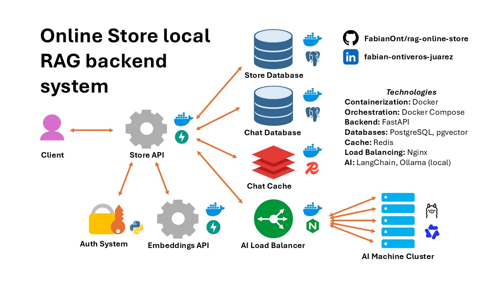
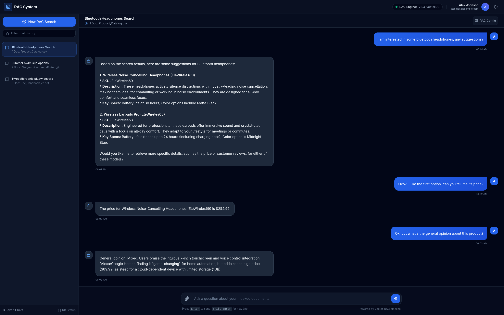

# A local RAG System for an Online Store


This project features a RAG system running multiple local Qwen 3.5 instances that are used by a containerized backend to handle customer queries related to an online store's products. The system is designed with a multi-service architecture paradigm and a planner RAG system to solve complex queries with context enriched by the recent messages in the current chat. The Store API includes user login, chat creation, and the loading of past conversations. Furthermore, the project includes a complete generation pipeline to populate the store database with products, customer reviews, product descriptions and specifications, FAQs, and warranty policies—all generated using the same self-hosted LLM service.



## Showcase

The system is populated with 612 products along with their corresponding descriptions, specifications, FAQs, and warranty policies, alongside 53K+ total reviews featuring controlled conditional generation of rating values on a 5-star scale. The showcase includes user sign-up and login, chat creation, message exchange, and chat loading to continue past conversations.



## About the RAG's planning strategy

After receiving the user's query $Q_0$, the system enhances $Q_0$ with the last $N$ messages (currently stored in cache) to produce a new contextualized query $Q_1$. This allows the system to infer relevant information about the topic, such as the specific product the conversation is about, since the LLM service is stateless. Next, $Q_1$ is classified as either a simple or complex query.
* **Simple:** The system allows an LLM with a small context window to decide which tools to use in a single step and return the RAG answer.
* **Complex:** The system calls an LLM with a greater context window and higher temperature to create the steps required to satisfy the user's query. Each step is then executed with specific instructions (an objective and the tool to use) by an LLM with a small context window. Finally, all responses are combined alongside $Q_1$ to produce the final response with the help of a summarizer LLM.

## Project Structure

```
project/
├── .devcontainer/
│   ├── Dockerfile
│   ├── devcontainer.json
│   └── requirements.txt
├── app-api/        
│   ├── config.py
│   ├── dependencies.py
│   ├── main.py
│   ├── routes/
│   │   ├── admin.py
│   │   └── customer.py
│   ├── schemas/
│   │   ├── admin.py
│   │   └── customer.py
│   └── services/
│       ├── chat_cache/
│       │   ├── config.py
│       │   ├── session.py
│       │   └── tools.py
│       ├── chat_db/
│       │   ├── crud.py
│       │   ├── models.py
│       │   ├── security.py
│       │   └── session.py
│       ├── embeddings/
│       │   └── tools.py
│       ├── rag/
│       │   ├── agent.py
│       │   ├── config.py
│       │   ├── db_session.py
│       │   ├── prompts.py
│       │   └── tools.py
│       └── store_db/
│           ├── crud.py
│           ├── models.py
│           └── session.py
├── assets/
│   ├── showcase.png
│   └── system_diagram.jpeg
├── chat-db/
│   ├── create_tables.sql
│   ├── create_users.sh
│   ├── grant_privileges.sh
│   └── init_tables.sh
├── client/
│   ├── __pycache__/
│   │   └── tools.cpython-314.pyc
│   ├── chat.html
│   ├── test.ipynb
│   └── tools.py
├── docker/
│   ├── app-api/
│   │   ├── Dockerfile
│   │   └── requirements.txt
│   ├── client/
│   │   ├── Dockerfile
│   │   └── requirements.txt
│   └── embeddings-api/
│       ├── Dockerfile
│       └── requirements.txt
├── embeddings-api/
│   ├── config.py
│   ├── dependencies.py
│   ├── main.py
│   ├── routes/
│   │   └── admin.py
│   ├── schemas/
│   │   └── admin.py
│   ├── scripts/
│   │   └── download_models.py
│   └── services/
│       └── embeddings/
│           └── core.py
├── ollama-lb/
│   └── nginx.conf
├── sample-data/
│   ├── categories.txt              # Generation basic config
│   ├── documents.json              # Auto generated file
│   ├── products.json               # Auto generated file
│   └── reviews/
│       ├── 00001.json              # Auto generated files
│           ...
├── scripts/
│   ├── generate_docs.py
│   ├── generate_products.py
│   ├── generate_reviews.py
│   └── loader.py
├── secrets.example/
│   ├── app_api_admin_key
│   ├── chat_cache_password
│   ├── chat_db_non_root_password
│   ├── chat_db_root_password
│   ├── embeddings_api_admin_key
│   ├── ollama_nodes
│   ├── store_db_agent_password
│   ├── store_db_non_root_password
│   └── store_db_root_password
├── store-db/
│   ├── create_tables.sql
│   ├── create_users.sh
│   ├── create_views.sql
│   └── grant_privileges.sh
├── docker-compose.yaml
├── .env.example
└── README.md

```


## How to run?
Build & download all images and run all containers

```bash
docker compose up --build
```

Then, open with a web browser the frontend app, located at [client/frontend.html](client/frontend.html).

## Generation Process

Create a Python environment with the same requirements than the Store API container and then run the generation + loading scripts.

```bash
python3 -m venv .venv
source .venv/bin/activate
pip install -r docker/store-api/requirements.txt

python3 scripts/generate_products.py
python3 scripts/generate_documents.py
python3 scripts/generate_reviews.py
python3 scripts/loader.py
```